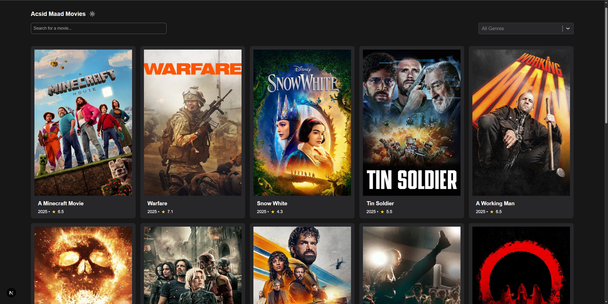

## 🎬 Movie App

A responsive movie browser built with **Next.js**, **React**, and **TypeScript**, using the **TMDB API**.

### Features:
- Search movies by title  
- Dark/Light theme toggle  
- Movie detail page  
- Fully responsive design  
- Optional genre/category filtering  
- Proper loading and error handling  

### Tech stack:
Next.js, React, TypeScript, Tailwind CSS, Zustand, Axios, React Query, React Select, Lodash Debounce

---

### 🛠️ How to run locally:

1. Create a `.env.local` file in the root of your project.
2. Add the following line with your TMDB API key:

```env
REACT_APP_TMDB_API_KEY=your_tmdb_api_key_here
```

> 📌 **Note**: A VPN may be required to load images or fetch data due to regional restrictions or TMDB API limitations.  
> Due to security reasons, `.env.local` is not included in the repository.

---

### 🖼️ Preview:


